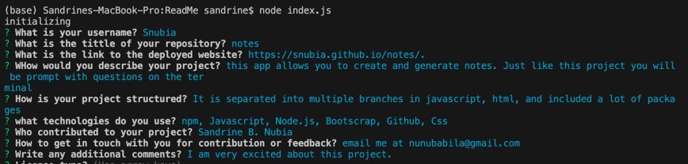
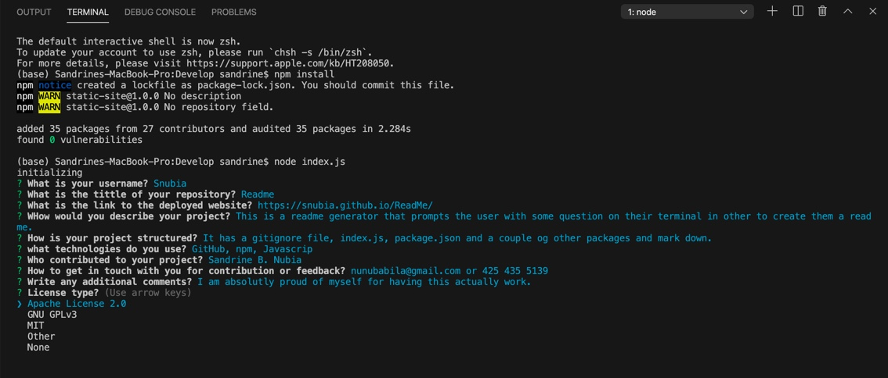

# Good-Readme
# ReadMe
This is a Readme Generator that as users a couple of questions in the terminal in other to generate a good readme for their repository.

**Technologies**
_Node.js
_Javascript
_npm
_Github

**Usage**

_Navigate to the Readme folder and install dependencies (run npm install)

_Run node index.js to begin

_Answer the questions about your prohect

**Demo**

[Click here to access the Github repository](https://github.com/Snubia/ReadMe.git)

**Feedback**

Contact me to provide feedback or suggestions 

[Linkedin](https://www.linkedin.com/in/sandrine-nubia-975aa2172/)

[Email](nunubabila@gmail.com)

